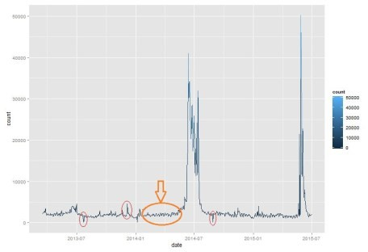
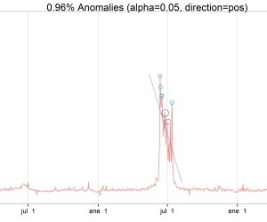

##Introduction
Inspired by this Netflix post, I decided to write a post based on this topic using R.

There are several nice packages to achieve this goal, the one we´re going to review is AnomalyDetection.
Download full –and tiny– R code of this post here[https://github.com/pablo14/anomaly_detection_post].

##Normal Vs. Abnormal

The definition for abnormal, or outlier, is an element which does not follow the behaviour of the majority.
Data has noise, same example as a radio which doesn’t have good signal, and you end up listening to some background noise.



* The orange section could be noise in data, since it oscillates around a value without showing a defined pattern, in other words: White noise
* Are the red circles noise or they are peaks from an undercover pattern?

> A good algorithm can detect abnormal points considering the inner noise and leaving it behind. The AnomalyDetectionTs in AnomalyDetection package can perform this task quite well.

##Hands on anomaly detection!

In this example, data comes from the well known wikipedia, which offers an API to download from R the daily page views given any {term + language}.

In this case, we’ve got page views from term fifa, language en, from 2013-02-22 up to today.

```{r results='hide', message=FALSE, warning=FALSE}
#install.packages("devtools")
library(devtools)
#devtools::install_github("petermeissner/wikipediatrend")
library(wikipediatrend)## Library containing API wikipedia access
#devtools::install_github("twitter/AnomalyDetection")
library(AnomalyDetection)
#install.packages("Rcpp")

library(ggplot2)
```
```{r results='hide'}
## Download wiki webpage "fifa" 
fifa_data = wp_trend("fifa", from="2013-03-18", lang = "en")

## Plotting data
ggplot(fifa_data, aes(x=date, y=count, color=count)) + geom_line()
```

```{r}
head(fifa_data, 10)
```

After applying the algorithm, we can plot the original time series plus the abnormal points in which the page views were over the expected value.

```{r}
## Convert date variable
fifa_data$date = as.POSIXct(fifa_data$date)

## Keep only desiered variables (date & page views)
fifa_data=fifa_data[,c(1,2)]

## Apply anomaly detection
data_anomaly = AnomalyDetectionTs(fifa_data, max_anoms=0.01, direction="pos", plot=TRUE, e_value = T)

#jpeg("./images/fifa_wikipedia_anomaly_detection.jpg", width= 8.25, height= 5.25, units="in", res=500, pointsize = 4)
## Plot original data + anomalies points
data_anomaly$plot
dev.off()
```
##About the algorithm

Parameters in algorithm are max_anoms=0.01 (to have a maximum of 0.01% outliers points in final result), and direction="pos" to detect anomalies over (not below) the expected value.

As a result, 8 anomalies dates were detected. Additionally, the algorithm returns what it would have been the expected value, and an extra calculation is performed to get this value in terms of percentage perc_diff.

```{r}
## Calculate deviation percentage from the expected value 
data_anomaly$anoms$perc_diff=round(100*(data_anomaly$anoms$expected_value-data_anomaly$anoms$anoms)/data_anomaly$anoms$expected_value)

## Plot anomalies table
anomaly_table=data_anomaly$anoms
```
##Discovering anomalies



Last plot shows a line indicating linear trend over an specific period -clearly decreasing-, and two black circles. It’s interesting to note that these black points were not detected by the algorithm because they are part of a decreasing tendency (noise perhaps?).
A really nice shot by this algorithm since the focus on detections are on the changes of general patterns. Just take a look at the last detected point in that period, it was a peak that didn’t follow the decreasing pattern (occurred on 2014-07-12).

##Checking with the news

These anomalies with the term fifa are correlated with the news, the first group of anomalies is related with the FIFA World Cup (around Jun/Jul 2014), and the second group centered on May 2015 is related with FIFA scandal.

In the LA Times it can be found a timeline about the scandal, and two important dates –May 27th and 28th-, which are two dates founded by the algorithm.

