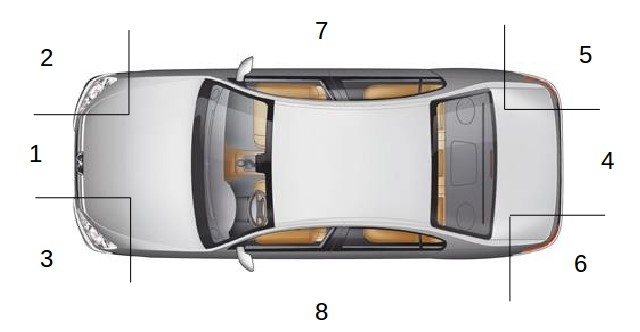

In car against car accidents, it might be interesting to see which parts of the cars were involved. On https://www.data.gouv.fr/fr/, we can find such a dataset, with a lot of information of car accident involving bodily injuries (in France, a police report is necessary, and all of them are reported in a big dataset… actually several dataset, with information of people involved, cars, locations, etc). For 2014 claims, the dataset is
```{r}

base = read.csv("https://www.data.gouv.fr/s/resources/base-de-donnees-accidents-corporels-de-la-circulation-sur-6-annees/20150806-153355/vehicules_2014.csv")
```
Let us keep only claims involving two vehicules,
```{r}
T=table(base$Num_Acc)
idx=names(T)[which(T==2)]
```
For 2014, we have 32,222 claims.
```{r}
length(idx)
```

In this dataset, we have information about where cars were hit,

image: 

plus ‘9’ for multiple hot (in rollover accidents) and ‘0’ should be missing information.
```{r}
nom=c("NA","Front","Front R",'Front L',"Back","Back R","Back L","Side R","Side L","Multiple")
```

Now, we simply have to go through our dataset, and get the matrix. My first idea was to get a symmetric one,
```{r}
B=base[base$Num_Acc %in% idx,]  
B=B[order(B$Num_Acc),]
M=matrix(0,10,10)
for(i in seq(1,nrow(B),by=2)){
   a=B$choc[i]+1
   b=B$choc[i+1]+1
   M[a,b]=M[a,b]+1
   M[b,a]=M[b,a]+1}
rownames(M)=nom
colnames(M)=nom
```

The problem, when we ask for a symmetric chord diagram, is that we cannot have Front – Front claims (since values on the diagonal are removed)
```{r}
library(circlize)
chordDiagramFromMatrix(M,symmetric=TRUE)
```

So let’s pretend that there could be some possible distinction in the dataset, between the first and the second row. Like the first one is the ‘responsible’ driver. Or like, for insurer, the first one is your insured. Just to avoid this symmetry problem
```{r}
M=matrix(0,10,10)
for(i in seq(1,nrow(B),by=2)){
   a=B$choc[i]+1
   b=B$choc[i+1]+1
   M[a,b]=M[a,b]+1}

rownames(M)=paste("A",nom,sep=" ")
colnames(M)=paste("B",nom,sep=" ")
```

If we visualize the chord diagram, this time it is more complex to analyze,
```{r}
chordDiagram(M)
```

Below we have the first row (say our driver, letter A) and on top, the second row (say the other driver, letter B),
In bodily injury claims, we observe a large proportion of Front – Front claims, as well as Front – Back. And as expected Back-Back are not that common….
